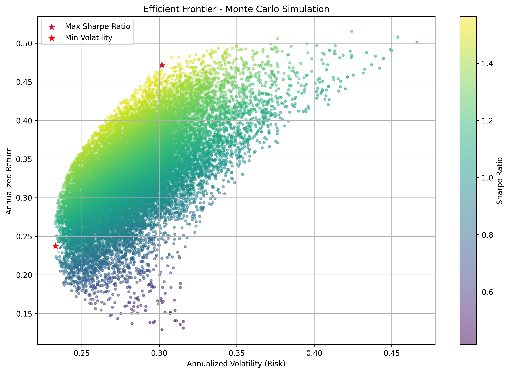

# Portfolio Correlation and Mean-Variance Optimization

This project uses **Modern Portfolio Theory** and a **Monte Carlo simulation** to explore portfolio diversification and find optimal investment weights. I built it as a way to learn more about how to measure risk and return in real portfolios.

## How It Works

The script runs through the whole process in one go:

* **Getting Data:** Pulls a year of daily stock prices with `yfinance`.
* **Processing:** Uses `pandas` to calculate daily percentage returns, which makes it easier to compare stocks fairly.
* **Simulation:** Generates 20,000 random portfolios with `numpy`, each with its own set of weights.
* **Analysis:** For every portfolio, it calculates expected return, volatility (risk), and the Sharpe Ratio (risk-adjusted return).

## What It Shows

The outputs help make the trade-offs in investing more concrete:

<div align="center" style="height: 400px;">
  
  
</div>

* **Correlation Heatmap:** Made with `seaborn` to see how stocks move together. I found that my tech picks were very correlated, meaning they often rise and fall at the same time.
* **Efficient Frontier:** A scatter plot of risk vs. return for all 20,000 portfolios. It clearly shows the trade-off: higher return usually means higher risk. The efficient frontier highlights the best combinations.
* **Optimal Portfolios:** The script points out two standouts:

  * The portfolio with the **lowest volatility** (least risky).
  * The one with the **highest Sharpe Ratio** (best balance of risk and reward).

## How to Run

1. Clone the repo.
2. Make a virtual environment:

   ```bash
   uv venv
   ```
3. Install dependencies:

   ```bash
   uv pip install -r requirements.txt
   ```
4. Run the script:

   ```bash
   python main.py
   ```

If you don’t already have a `requirements.txt`, you can create one inside your environment with:

```bash
uv pip freeze > requirements.txt
```